<div align="center">
<pre>
┌─────────────────────────────────────────────────────────────────────────────────────────────────────┐
│                                                                                                     │
│    ███   ███   ████    ████  █████    █████        ████   █████  █      █████  ████    ███   █   █  │
│      █  █   █  █   █  █      █        █            █   █  █      █        █    █   █  █   █  ██  █  │
│      █  █   █  █   █  █      █        █            █   █  █      █        █    █   █  █   █  █ █ █  │
│      █  █   █  ████   █ ███  ████     ████         ████   ████   █        █    ████   █████  █  ██  │
│  █   █  █   █  ██     █   █  █        █            █   █  █      █        █    ██     █   █  █   █  │
│  █   █  █   █  █ █    █   █  █        █            █   █  █      █        █    █ █    █   █  █   █  │
│   ███    ███   █  █    ████  █████    █      █     ████   █████  █████    █    █  █   █   █  █   █  │
│                                                                                                     │
│                     [ COMPUTATIONAL BIOLOGY ] · [ BIOINFORMATICS ] · [ AI / ML ]                    │
│                                                                                                     │
│                    MODEL SCI.01 · BUILD BIOCHEMINTELLI · REGION CL · REV 2026.09                    │
│                                                                                                     │
└─────────────────────────────────────────────────────────────────────────────────────────────────────┘
</pre>
</div>

<div align="center">

[](https://www.biochemintelli.com/)
[](https://scholar.google.com/citations?user=blPKcQEAAAAJ&hl=es)
[](mailto:beltran.lissabet.jf@gmail.com)

</div>


### `[ 01 ]` ABOUT

```
> SENIOR SCIENTIST
> FOCUS ..... proteomics · systems biology · toxicity prediction · viral oncology
> BUILDS .... open-source pipelines that turn raw biological data into signal
> PLATFORM .. biochemintelli — ai-driven bioinformatics tools
> BASE ...... chile
```

Computational biologist working at the interface of **structural biology**, **machine learning**, and **drug discovery** — reproducible pipelines over one-off scripts, open tools over black boxes.


### `[ 02 ]` STACK

<div align="center">


</div>


### `[ 03 ]` INDEX

<table>
<tr>
<td width="50%">

**`01` [AIDApy](https://github.com/jfbldevs/AIDApy)**
Computation of 544 physicochemical and biochemical properties from the AAindex database.


</td>
<td width="50%">

**`02` [MultiToxPred](https://github.com/jfbldevs/MultiToxPred)**
Multi-label toxicity prediction using machine learning.


</td>
</tr>
<tr>
<td width="50%">

**`03` [HPV-E6-E7-Atlas](https://github.com/jfbldevs/HPV-E6-E7-Atlas)**
Pan-genotype mutational tolerance atlas of HPV E6/E7 oncoproteins via the ESM-2 protein language model.


</td>
<td width="50%">

**`04` [VirUsHound-II](https://github.com/jfbldevs/virushound-II)**
Advanced virus analysis and classification tool (v2).


</td>
</tr>
<tr>
<td width="50%">

**`05` [Daphnia Proteome Stress](https://github.com/jfbldevs/daphnia-pulex-proteome-stress)**
Integrative systems-biology pipeline for *D. pulex* proteomics under anthropogenic stress.


</td>
<td width="50%">

**`06` [RPPA Cancer Dependency](https://github.com/jfbldevs/rppa-cancer-dependency-prediction)**
Cancer dependency prediction from reverse-phase protein array data.


</td>
</tr>
</table>


### `[ 04 ]` METRICS

<div align="center">




</div>

<div align="center">
<sub>Generated by a scheduled GitHub Action in this repo (<code>.github/workflows/metrics.yml</code>) — no third-party server involved, refreshes daily.</sub>
</div>


### `[ 05 ]` FOCUS

```text
COMPUTATIONAL BIOLOGY     ●●●●●●●●●●●●●●●●●●●●○○○○○   85%
AI / DRUG DISCOVERY       ●●●●●●●●●●●●●●●●●●●●○○○○○   80%
TOXICITY PREDICTION       ●●●●●●●●●●●●●●●●●○○○○○○○○   75%
VIRAL ONCOLOGY            ●●●●●●●●●●●●●●●●○○○○○○○○○   65%
SYSTEMS BIOLOGY           ●●●●●●●●●●●●●●○○○○○○○○○○○   60%
```


<div align="center">

<sub>ADVANCING SCIENCE THROUGH INTELLIGENT DATA ANALYSIS</sub>

[](https://www.biochemintelli.com/)

</div>
